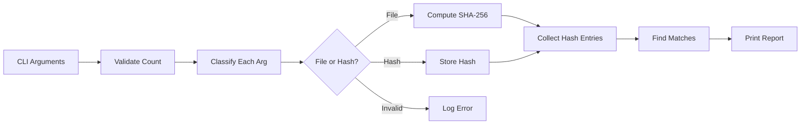

# Design Document: Hash Comparator

## Overview

A single-file Go command-line tool that accepts 2-10 arguments (file paths or SHA-256 hash strings), computes hashes for files, and reports all matches. The design prioritizes simplicity, readability, and cross-platform compatibility.

## Architecture

The tool follows a simple linear pipeline architecture:

```
Arguments → Validation → Classification → Hash Computation → Comparison → Report
```



No external dependencies — only Go standard library.

## Components and Interfaces

### Main Function
Entry point that orchestrates the pipeline:
1. Validates argument count
2. Processes each argument
3. Finds matches
4. Prints report

### HashEntry Struct
Represents a processed argument:
```go
type HashEntry struct {
    Original string  // The original argument (file path or hash string)
    Hash     string  // The SHA-256 hash (computed or provided), empty if invalid
    IsFile   bool    // True = file path, False = provided hash OR invalid argument
    Error    error   // Non-nil if processing failed; combine with IsFile to interpret state
}
// State interpretation:
// - IsFile=true,  Error=nil  → Valid file, hash computed successfully
// - IsFile=true,  Error!=nil → File exists but couldn't be read
// - IsFile=false, Error=nil  → Valid hash string provided
// - IsFile=false, Error!=nil → Invalid argument (neither file nor valid hash)
```

### Core Functions

#### validateArgCount(args []string) error
- Checks that len(args) is between 2 and 10
- Returns descriptive error if out of range

#### classifyArgument(arg string) (isFile bool, isHash bool)
- Checks if arg exists as a file on filesystem
- Checks if arg is a valid 64-character hex string
- Returns classification flags

#### isValidSHA256(s string) bool
- Returns true if string is exactly 64 hex characters
- Case-insensitive check

#### computeFileHash(filepath string) (string, error)
- Opens file for reading
- Streams content through SHA-256 hasher
- Returns lowercase hex-encoded hash

#### processArgument(arg string) HashEntry
- Classifies the argument
- Computes hash if file, stores if hash string
- Returns populated HashEntry

#### findMatches(entries []HashEntry) map[string][]HashEntry
- Groups entries by hash value
- Returns only groups with 2+ entries (actual matches)

#### printReport(matches map[string][]HashEntry, entries []HashEntry)
- First lists ALL processed arguments with their computed/provided hashes
- Then prints match groups with clear formatting
- Prints "no matches" message if no matches found
- Shows errors inline with the argument that caused them

## Data Models

### HashEntry
| Field    | Type   | Description                                              |
|----------|--------|----------------------------------------------------------|
| Original | string | Original CLI argument                                    |
| Hash     | string | SHA-256 hash (64 hex chars, lowercase), empty if invalid |
| IsFile   | bool   | True = file path, False = hash string OR invalid         |
| Error    | error  | Processing error, nil if successful                      |

**State interpretation:**
- `IsFile=true, Error=nil` → Valid file, hash computed
- `IsFile=true, Error!=nil` → File exists but couldn't be read
- `IsFile=false, Error=nil` → Valid hash string provided
- `IsFile=false, Error!=nil` → Invalid argument (neither file nor hash)

### Match Group
A map entry where:
- Key: SHA-256 hash string
- Value: Slice of HashEntry structs sharing that hash

## Correctness Properties

*A property is a characteristic or behavior that should hold true across all valid executions of a system—essentially, a formal statement about what the system should do.*

### Property 1: Argument Count Validation

*For any* argument count less than 2 or greater than 10, the validateArgCount function SHALL return an error. *For any* argument count between 2 and 10 inclusive, the function SHALL return nil.

**Validates: Requirements 1.1, 1.2, 1.3**

### Property 2: SHA-256 Hash String Detection

*For any* string that is exactly 64 characters long and contains only hexadecimal characters (0-9, a-f, A-F), the isValidSHA256 function SHALL return true. *For any* string that does not meet these criteria, it SHALL return false.

**Validates: Requirements 2.2**

### Property 3: Hash Computation Correctness

*For any* readable file, computing its hash with computeFileHash and then computing it again SHALL produce the same result (determinism). Additionally, the result SHALL match the output of Go's standard crypto/sha256 package.

**Validates: Requirements 3.1**

### Property 4: Match Grouping Correctness

*For any* set of HashEntry structs, the findMatches function SHALL group all entries with identical hash values together, and SHALL only return groups containing 2 or more entries.

**Validates: Requirements 4.1, 4.2**

### Property 5: Classification Mutual Exclusivity

*For any* argument string, classifyArgument SHALL return at most one true value (either isFile or isHash, but not both). A string cannot be both a file and a valid hash simultaneously in classification.

**Validates: Requirements 2.1, 2.2**

## Error Handling

| Scenario | Behavior |
|----------|----------|
| Fewer than 2 arguments | Print usage error, exit code 1 |
| More than 10 arguments | Print limit error, exit code 1 |
| File does not exist | Log error for that argument, continue processing |
| File cannot be read | Log error for that argument, continue processing |
| Invalid argument format | Log error for that argument, continue processing |
| No matches found | Print "No matches found" message, exit code 0 |

Errors for individual arguments do not halt processing — the tool processes all valid arguments and reports all errors at the end.

## Testing Strategy

### Unit Tests
- Test boundary conditions for argument count (0, 1, 2, 10, 11)
- Test hash validation with valid and invalid strings
- Test file hash computation against known values
- Test match grouping with various input combinations

### Property-Based Tests
- Use Go's `testing/quick` package for property-based testing
- Each property test runs minimum 100 iterations
- Tests generate random inputs within valid domains

**Property Test Configuration:**
- Framework: Go standard library `testing/quick`
- Iterations: 100+ per property
- Tag format: `// Feature: hash-compare, Property N: description`

### Test Files
- `main_test.go` — contains all unit and property tests
- Tests are co-located with source for simplicity

