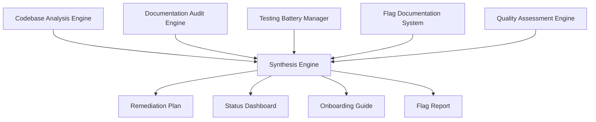

# Design Document: The hashi Project

## Overview

This design document describes the architecture and implementation of `hashi`, a command-line hash comparison tool built from the ground up to follow industry-standard CLI design guidelines. This is a **complete rewrite** implementing a modular architecture with human-first design principles.

**Project Status**: v0.0.19 - Feature-complete CLI tool with comprehensive testing infrastructure, security features, and major checkpoint analysis framework. Core functionality exceeds original design scope with strategic architectural improvements.

**JSON Enchancments**: docs/adr/002-json-jsonl-output-formats.md details decisions made regarding JSON and JSONL support.

## Guiding Principles

### 1. Developer Continuity
Every function explains *why* it exists, not just *what* it does. Architecture decisions are documented with rationale. The codebase serves as a teaching tool, not just a product.

### 2. User-First Design
Everything is designed with the question: "What functionality does the user need, and what behavior does the user expect?" Features solve real user problems, defaults match user expectations, and error messages guide users to solutions.

### 3. No Lock-Out
Users must never be locked out of functionality due to design choices. Every default behavior has an escape hatch:
- `--preserve-order` bypasses default grouping when users need input order
- When adding new "smart" defaults, always provide a flag to override them

### 4. CLI Guidelines Compliance
All design decisions follow the [CLI Guidelines](https://clig.dev/) standard, prioritizing:
- Human-first design with machine-readable alternatives
- Simple parts that work together (composability)
- Consistency across the interface
- Appropriate verbosity (saying just enough)
- Ease of discovery
- Conversational interaction
- Robustness and reliability

## Architecture Overview

Hashi follows a layered architecture with clear separation of concerns. The current implementation includes 11 internal packages with focused responsibilities:

```
┌─────────────────────────────────────────────────────────────┐
│                         CLI Layer                            │
│  Entry point, argument parsing, help system                 │
│  Location: cmd/hashi/main.go                                │
└─────────────────────────────────────────────────────────────┘
                              ↓
┌─────────────────────────────────────────────────────────────┐
│                    Configuration Layer                       │
│  internal/config/    - Argument parsing, flag handling      │
│  internal/conflict/  - Pipeline of Intent state machine     │
│  internal/security/  - Path validation, write protection    │
└─────────────────────────────────────────────────────────────┘
                              ↓
┌─────────────────────────────────────────────────────────────┐
│                     Processing Layer                         │
│  internal/hash/      - Hash computation, file discovery     │
│  internal/checkpoint/- Major checkpoint analysis framework  │
└─────────────────────────────────────────────────────────────┘
                              ↓
┌─────────────────────────────────────────────────────────────┐
│                       Output Layer                           │
│  internal/output/    - Formatters (default, JSON, plain)    │
│  internal/console/   - I/O stream management (split streams)│
│  internal/color/     - TTY detection, color handling        │
│  internal/progress/  - Progress indicators                  │
│  internal/errors/    - Error formatting, suggestions        │
└─────────────────────────────────────────────────────────────┘
                              ↓
┌─────────────────────────────────────────────────────────────┐
│                      Control Layer                           │
│  internal/signals/   - Signal handling (Ctrl-C)             │
└─────────────────────────────────────────────────────────────┘
```

### Major Architectural Enhancements

**Split Streams Architecture**: Strict separation of data (stdout) and context (stderr) enables safe piping and redirection while maintaining user feedback.

**Pipeline of Intent Conflict Resolution**: Three-phase state machine (Mode → Format → Verbosity) replaces complex matrix-based conflict detection with linear, intuitive behavior.

**Major Checkpoint Analysis Framework**: Sophisticated analysis system with 5 parallel engines for codebase quality assessment, transforming hashi from a simple utility into a comprehensive development tool.


## Core Components

### 1. Configuration System (`internal/config/`)

**Purpose**: Parse command-line arguments, load configuration from multiple sources, and merge with proper precedence.

**Key Design Decisions**:
- **TOML format**: Human-readable configuration files (implemented)
- **Pipeline of Intent**: Sophisticated conflict resolution via state machine
- **Safe config display**: `--show-config` reveals minimal information, no sensitive paths
- **Per-directory config**: Support `.hashi.toml` in current directory
- **Fixed precedence**: Flags > Environment variables > Config file > Defaults (corrected in v0.0.19)

**Key Types**:
```go
type Config struct {
    // Input sources
    Files  []string
    Hashes []string
    
    // Behavior flags
    Recursive     bool
    Hidden        bool
    Algorithm     string
    Verbose       bool
    Quiet         bool
    Bool          bool          // Boolean output for scripting
    PreserveOrder bool          // Maintain input order vs grouping by hash
    
    // Exit code control
    MatchRequired bool          // Exit 0 only if matches found
    
    // Output configuration
    OutputFormat string         // "default", "verbose", "json", "plain"
    OutputFile   string
    Append       bool
    Force        bool
    
    // Logging
    LogFile string
    LogJSON string
    
    // Filtering (fully implemented)
    Include        []string     // Glob patterns for files to include
    Exclude        []string     // Glob patterns for files to exclude
    MinSize        int64        // Minimum file size in bytes
    MaxSize        int64        // Maximum file size in bytes
    ModifiedAfter  time.Time    // Only process files modified after this date
    ModifiedBefore time.Time    // Only process files modified before this date
    
    // Security
    BlacklistFiles []string     // Security blacklist for sensitive files
    BlacklistDirs  []string     // Security blacklist for sensitive directories
    WhitelistFiles []string     // Security whitelist override
    WhitelistDirs  []string     // Security whitelist override
    
    // Configuration file
    ConfigFile string
    
    // Help and version
    ShowHelp    bool
    ShowVersion bool
}
```

**Configuration File Format**: TOML (human-readable, well-supported)

**Configuration Precedence** (highest to lowest):
1. Command-line flags
2. Environment variables (HASHI_* prefix)
3. Project-level config (`.hashi.toml` in working directory)
4. User-level config (`~/.config/hashi/config.toml`)
5. Built-in defaults

**TOML Configuration Example**:
```toml
# ~/.config/hashi/config.toml
[defaults]
algorithm = "sha256"
output_format = "plain"
recursive = false
quiet = false

[security]
blacklist_files = [".env", ".ssh/*", "*.key"]
blacklist_dirs = [".git", ".ssh"]
```

**Config File Auto-Discovery**:
When no `--config` flag is provided, hashi searches for config files in this order:
1. `./.hashi.toml` - Project-specific (highest priority)
2. `$XDG_CONFIG_HOME/hashi/config.toml` - XDG standard
3. `~/.config/hashi/config.toml` - XDG fallback
4. `~/.hashi/config.toml` - Traditional dotfile

**Security-First Design**:
- No paths, no values, no structure exposed in config display
- Only shows effective settings and source types
- Perfect for automation/scripting
- Secure by default
- Links to documentation for advanced needs


### 2. Color and TTY Detection (`internal/color/`)

**Purpose**: Detect terminal capabilities and manage color output according to CLI guidelines.

**Key Features**:
- Automatic TTY detection using `term.IsTerminal()`
- Respects `NO_COLOR` environment variable
- Respects `TERM=dumb`
- Individual checking of stdout and stderr (colors on stderr even when stdout is piped)
- Provides semantic color methods (Success, Error, Warning, Info, Path)

**Color Scheme**:
- **Green**: Matches, success messages
- **Red**: Errors, mismatches
- **Yellow**: Warnings
- **Blue**: Informational messages
- **Cyan**: File paths
- **Gray**: Secondary information

**Interface**:
```go
type ColorHandler struct {
    stdoutEnabled bool
    stderrEnabled bool
}

func NewColorHandler() *ColorHandler
func (c *ColorHandler) Success(text string) string
func (c *ColorHandler) Error(text string) string
func (c *ColorHandler) Warning(text string) string
func (c *ColorHandler) Info(text string) string
func (c *ColorHandler) Path(text string) string
```


### 3. Progress Indicators (`internal/progress/`)

**Purpose**: Show progress for operations taking longer than 100ms, following CLI guidelines for responsive feedback.

**Key Features**:
- Only displays when stdout is a TTY
- Shows percentage, count, and ETA
- Supports both file-level and batch-level progress
- Automatically hides when operation completes quickly (<100ms)

**Display Format**:
```
Processing files... [████████████░░░░░░░░] 60% (6/10) ETA: 2s
```

**Interface**:
```go
type ProgressBar struct {
    total int64
    current int64
    startTime time.Time
    enabled bool
}

func NewProgressBar(total int64) *ProgressBar
func (p *ProgressBar) Update(n int64)
func (p *ProgressBar) Finish()
```


### 4. Error Handling (`internal/errors/`)

**Purpose**: Transform technical errors into user-friendly messages with actionable suggestions.

**Design Philosophy**:
- **Be Specific**: Tell the user exactly what went wrong
- **Be Actionable**: Suggest how to fix the problem
- **Be Concise**: Keep messages short and to the point
- **Be Friendly**: Use conversational language, not technical jargon
- **Group Similar Errors**: Reduce noise by grouping repeated error types

**Error Categories**:
1. **User Input Errors**: Invalid arguments, missing files, bad hash format
2. **File System Errors**: Permission denied, file not found, disk full
3. **Processing Errors**: Hash computation failures, memory issues
4. **Configuration Errors**: Invalid config file, bad environment variables

**Example Transformations**:

Before (technical):
```
Error: failed to open file "document.pdf": no such file or directory
```

After (user-friendly):
```
✗ Cannot find file: document.pdf

  The file doesn't exist in the current directory.
  
  Try:
    • Check the file name for typos
    • Use 'ls' to see available files
    • Provide the full path: /path/to/document.pdf
```

**Interface**:
```go
type ErrorHandler struct {
    verbose bool
}

func (e *ErrorHandler) FormatError(err error) string
func (e *ErrorHandler) SuggestFix(err error) string
func (e *ErrorHandler) GroupErrors(errors []error) []ErrorGroup
```


### 5. Hash Computation (`internal/hash/`)

**Purpose**: Compute cryptographic hashes efficiently using streaming for memory efficiency.

**Key Features**:
- Streaming file processing (never loads entire file into memory)
- Support for multiple algorithms (SHA-256, SHA-512, MD5, SHA-1)
- Efficient handling of large files
- Progress tracking integration

**Interface**:
```go
type HashEntry struct {
    Original string    // Original argument (file path or hash string)
    Hash string        // Computed or provided hash
    IsFile bool        // True if this is a file path
    Error error        // Processing error if any
    Size int64         // File size in bytes
    ModTime time.Time  // File modification time
    Algorithm string   // Hash algorithm used
}

func ComputeFileHash(filepath string, algorithm string) (string, error)
func ProcessEntries(entries []string, config *Config) ([]HashEntry, error)
```

**Streaming Implementation**:
```go
func ComputeFileHash(filepath string, algorithm string) (string, error) {
    file, err := os.Open(filepath)
    if err != nil {
        return "", err
    }
    defer file.Close()
    
    hasher := createHasher(algorithm)
    
    // Stream in chunks - memory efficient for any file size
    _, err = io.Copy(hasher, file)
    if err != nil {
        return "", err
    }
    
    return hex.EncodeToString(hasher.Sum(nil)), nil
}
```

#### Hash Algorithm Detection

**Purpose**: Detect possible hash algorithms from a hash string based on length and character validation.

**Hash Length Reference**:
- MD5: 32 characters
- SHA-1: 40 characters
- SHA-256: 64 characters (default)
- SHA-512: 128 characters
- BLAKE2b-512: 128 characters

**Interface**:
```go
// DetectHashAlgorithm returns possible algorithms for a hash string.
// Returns empty slice if not a valid hash format.
// Returns multiple algorithms if ambiguous (e.g., SHA-512 and BLAKE2b-512 both = 128 chars).
func DetectHashAlgorithm(hashStr string) []string
```

**Logic**:
1. Check if string contains only hex characters (0-9, a-f, A-F)
2. Check length against known algorithms
3. Return all matching algorithms
4. Return empty slice if no match

**Example outputs**:
- `"a1b2c3d4..."` (32 chars) → `["md5"]`
- `"abc123..."` (64 chars) → `["sha256"]`
- `"def456..."` (128 chars) → `["sha512", "blake2b"]`
- `"xyz"` (3 chars) → `[]`
- `"gggggg..."` (64 chars, invalid hex) → `[]`


#### Argument Classification

**Purpose**: Separate command-line arguments into files and hash strings with clear precedence rules.

**Interface**:
```go
// ClassifyArguments separates command-line arguments into files and hash strings.
// Files take precedence: if an argument exists as a file, it's treated as a file
// even if it looks like a valid hash string.
//
// Parameters:
//   args - raw command-line arguments (after flag parsing)
//   algorithm - the current hash algorithm (from --algo flag or default)
//
// Returns:
//   files - list of file paths
//   hashes - list of hash strings
//   error - helpful error if hash doesn't match current algorithm
func ClassifyArguments(args []string, algorithm string) (files []string, hashes []string, err error)
```

**Classification Logic** (for each argument):
1. Check if file exists with `os.Stat(arg)` → add to files list
2. If not a file, call `DetectHashAlgorithm(arg)`
3. If no algorithms detected → treat as file (will error later if not found)
4. If algorithms detected:
   - If current algorithm in list → add to hashes list
   - If current algorithm NOT in list and only 1 detected → return error with suggestion
   - If current algorithm NOT in list and multiple detected → return error listing options

**Error Messages**:
```
Hash length doesn't match sha256 (expected 64 characters, got 32).
This looks like MD5. Try: hashi --algo md5 file.txt [hash]
```

```
Hash length doesn't match sha256 (expected 64 characters, got 128).
Could be: sha512, blake2b
Specify algorithm with: hashi --algo sha512 file.txt [hash]
```


### 6. Output Formatters (`internal/output/`)

**Purpose**: Format results in multiple output formats for both human and machine consumption.

**Formatter Types**:

#### Default Formatter (Human-First)
Groups files by matching hash with blank lines between groups. This makes it easy to visually identify duplicates.

```
file_name_1.txt    e3b0c44298fc1c149afbf4c8996fb92427ae41e4649b934ca495991b7852b855
file_name_4.pdf    e3b0c44298fc1c149afbf4c8996fb92427ae41e4649b934ca495991b7852b855

file_name_2.doc    a1b2c3d4e5f6789012345678901234567890123456789012345678901234567890
file_name_3.zip    a1b2c3d4e5f6789012345678901234567890123456789012345678901234567890
file_name_7.tar    a1b2c3d4e5f6789012345678901234567890123456789012345678901234567890

file_name_5.jpg    9876543210abcdef9876543210abcdef9876543210abcdef9876543210abcdef
```

Key features:
- Files grouped by matching hash
- Blank line between groups
- Groups with 2+ files are matches
- Single files are unmatched
- Still pipeable (one file per line, consistent format)

#### Preserve Order Formatter
Maintains input order when `--preserve-order` flag is used. Same format but no grouping.

#### Verbose Formatter
Provides detailed output with summaries:

```
Processed 7 files in 0.234s

Match Groups:
  Group 1 (2 files):
    file_name_1.txt    e3b0c44298fc1c149afbf4c8996fb92427ae41e4649b934ca495991b7852b855
    file_name_4.pdf    e3b0c44298fc1c149afbf4c8996fb92427ae41e4649b934ca495991b7852b855
  
  Group 2 (3 files):
    file_name_2.doc    a1b2c3d4e5f6789012345678901234567890123456789012345678901234567890
    file_name_3.zip    a1b2c3d4e5f6789012345678901234567890123456789012345678901234567890
    file_name_7.tar    a1b2c3d4e5f6789012345678901234567890123456789012345678901234567890

Unmatched Files:
  file_name_5.jpg    9876543210abcdef9876543210abcdef9876543210abcdef9876543210abcdef

Summary: 2 match groups, 1 unmatched file
```

#### JSON Formatter
Machine-readable structured output:

```json
{
  "processed": 7,
  "duration_ms": 234,
  "match_groups": [
    {
      "hash": "e3b0c44298fc1c149afbf4c8996fb92427ae41e4649b934ca495991b7852b855",
      "count": 2,
      "files": ["file_name_1.txt", "file_name_4.pdf"]
    }
  ],
  "unmatched": [
    {
      "file": "file_name_5.jpg",
      "hash": "9876543210abcdef9876543210abcdef9876543210abcdef9876543210abcdef"
    }
  ],
  "errors": []
}
```

#### Plain Formatter
Tab-separated output optimized for grep/awk/cut:

```
file_name_1.txt	e3b0c44298fc1c149afbf4c8996fb92427ae41e4649b934ca495991b7852b855
file_name_2.doc	a1b2c3d4e5f6789012345678901234567890123456789012345678901234567890
```

No grouping, no blank lines, consistent format for scripting.


### 8. Signal Handling (`internal/signals/`)

**Purpose**: Handle Ctrl-C gracefully according to CLI guidelines.

**Behavior**:
- **First Ctrl-C**: Stop processing immediately, show status, run cleanup with timeout
- **Second Ctrl-C**: Skip remaining cleanup, exit immediately
- **Always**: Display what cleanup was skipped (if any)

**Design Philosophy**:
- Exit as soon as possible (responsive)
- Leave system in recoverable state (crash-only design)
- Expect to be started when cleanup hasn't run
- Never hang on cleanup (5-second timeout)

**Interface**:
```go
type SignalHandler struct {
    interrupted bool
    cleanup func()
    cleanupTimeout time.Duration
}

func NewSignalHandler(cleanup func()) *SignalHandler
func (s *SignalHandler) Start()
func (s *SignalHandler) IsInterrupted() bool
```

**Example Output**:
```
^C
Interrupted. Cleaning up...
(Press Ctrl-C again to force quit)

Cleanup complete. Exiting.
```

Or if forced:
```
^C
Interrupted. Cleaning up...
^C
Forced exit. Skipped: temp file cleanup
```


### 9. Flag Conflict Detection (`internal/conflict/`)

**Purpose**: Handle conflicting flag combinations using Pipeline of Intent state machine.

**Design Philosophy**: Linear conflict resolution with clear rules for different phases.

**Pipeline of Intent Architecture**:
```go
// Three-phase conflict resolution
Phase 1: Mode (What are we doing? Standard vs Boolean)
Phase 2: Format (How does it look? Default vs JSON vs Plain)
Phase 3: Verbosity (How loud? Normal vs Quiet vs Verbose)
```

**Conflict Resolution Rules**:
```go
// Key Design Decisions:
// - Quiet overrides Verbose (respects explicit user intent)
// - JSON + Verbose coexist (split streams enable composition)
// - Bool overrides JSON (mode > format)
// - JSON vs Plain: Last one wins (allows override of defaults)
```

**Interface**:
```go
type ConflictResolver struct {
    logger io.Writer
}

func NewResolver() *ConflictResolver
func (c *ConflictResolver) ResolveConflicts(config *Config) error
func (c *ConflictResolver) ApplyPipelineOfIntent(config *Config) []string // Returns warnings
```

**Benefits over Matrix-Based System**:
- Reduced complexity from N! to linear
- More intuitive user experience
- Easier to extend with new flags
- Better composability


### 10. Exit Code System

**Purpose**: Provide meaningful exit codes for scripting and automation.

**Exit Codes**:
```go
const (
    ExitSuccess         = 0   // All files processed successfully
    ExitNoMatches       = 1   // No matches found (with --match-required)
    ExitMatchesFound    = 1   // Matches found (with --no-match-required)
    ExitPartialFailure  = 2   // Some files failed to process
    ExitInvalidArgs     = 3   // Invalid arguments or flags
    ExitFileNotFound    = 4   // One or more files not found
    ExitPermissionError = 5   // Permission denied
    ExitIntegrityFail   = 6   // Archive integrity verification failed
    ExitInterrupted     = 130 // Interrupted by Ctrl-C (128 + SIGINT)
)
```

**Behavior**:
- **Default**: Exit 0 if all files processed, non-zero for errors
- **With `--match-required`**: Exit 0 only if matches found, 1 if no matches
- **With `--no-match-required`**: Exit 0 only if no matches found, 1 if matches exist
- **Always**: Use specific error codes for invalid args, file not found, etc.

**Scripting Examples**:
```bash
# Check if files match (boolean check)
if hashi file1.txt file2.txt --match-required --quiet; then
    echo "Files are identical"
else
    echo "Files differ"
fi

# Verify no duplicates exist
if hashi *.jpg --no-match-required --quiet; then
    echo "No duplicate images"
else
    echo "Duplicates found!"
fi

# Complex check with filtering
if hashi --recursive --include "*.pdf" --min-size 1MB --match-required -q; then
    echo "Found duplicate large PDFs"
    # Now run again without --quiet to see details
    hashi --recursive --include "*.pdf" --min-size 1MB
fi
```

**Quiet Mode**:
- With `-q` or `--quiet`: Suppress all stdout, only return exit code
- Errors still go to stderr (so failures can be diagnosed)
- Perfect for boolean checks in scripts


### 11. Security System (`internal/security/`)

**Purpose**: Provide comprehensive security features including path validation and write protection.

**Key Features**:
- Path validation to prevent directory traversal attacks
- Blacklist/whitelist system for sensitive files and directories
- Write protection for security-sensitive operations
- Error obfuscation for security-sensitive failures

**Interface**:
```go
type SecurityManager struct {
    blacklistFiles []string
    blacklistDirs  []string
    whitelistFiles []string
    whitelistDirs  []string
}

func NewSecurityManager(config *Config) *SecurityManager
func (s *SecurityManager) ValidatePath(path string) error
func (s *SecurityManager) IsBlacklisted(path string) bool
func (s *SecurityManager) IsWhitelisted(path string) bool
func (s *SecurityManager) CanWrite(path string) error
```

**Security Features**:
- **Path Validation**: Prevents directory traversal attacks (..)
- **Write Protection**: Blacklist/whitelist system for sensitive files (.env, .ssh, config files)
- **Error Obfuscation**: Security-sensitive failures return generic errors unless --verbose
- **Read-Only Operation**: Never modifies source files
- **Safe File Writing**: Only allows .txt, .json, .csv extensions

### 12. Console I/O Management (`internal/console/`)

**Purpose**: Manage I/O streams with split streams architecture for better composability.

**Split Streams Design**:
- **stdout**: Only the requested result (clean JSON, hashes, boolean)
- **stderr**: Progress bars, warnings, errors, verbose logs

**Benefits**:
- Enables safe piping and redirection
- Maintains user feedback during processing
- Better composability with other CLI tools

**Interface**:
```go
type StreamManager struct {
    stdout io.Writer
    stderr io.Writer
}

func NewStreamManager() *StreamManager
func (s *StreamManager) WriteData(data []byte) error     // To stdout
func (s *StreamManager) WriteContext(data []byte) error  // To stderr
func (s *StreamManager) IsStdoutTTY() bool
func (s *StreamManager) IsStderrTTY() bool
```

### 13. Major Checkpoint Analysis Framework (`internal/checkpoint/`)

**Purpose**: Comprehensive codebase analysis and quality assessment system with 5 parallel analysis engines.

**Architecture**:


**Analysis Engines**:
1. **CodeAnalyzer**: Static analysis, security scanning, dependency auditing
2. **DependencyAnalyzer**: go.mod dependency analysis and security updates
3. **DocAuditor**: Go documentation validation, README verification, example testing
4. **TestingBattery**: Test coverage analysis, missing test identification
5. **FlagSystem**: CLI flag cataloging and status classification
6. **QualityEngine**: Code standards, CLI design, error handling, performance

**Data Models**:
```go
type Issue struct {
    ID          string         `json:"id"`
    Category    IssueCategory  `json:"category"`    // code_quality, documentation, testing, etc.
    Severity    Severity       `json:"severity"`    // critical, high, medium, low, info
    Title       string         `json:"title"`
    Description string         `json:"description"`
    Location    string         `json:"location"`
    Suggestion  string         `json:"suggestion"`
    Effort      EffortEstimate `json:"effort"`      // xs, small, medium, large, xl
    Priority    Priority       `json:"priority"`    // P0, P1, P2, P3
}

type FlagStatus struct {
    Name             string               `json:"name"`
    Status           ImplementationStatus `json:"status"`
    ExpectedBehavior string               `json:"expected_behavior"`
    ActualBehavior   string               `json:"actual_behavior"`
    TestCoverage     bool                 `json:"test_coverage"`
    Documentation    bool                 `json:"documentation"`
}
```

**Synthesis Engine**:
- Aggregates findings from all analysis engines
- Generates remediation plans with prioritized tasks
- Creates status dashboards with health metrics
- Produces developer onboarding guides
- Generates flag status reports

**Interface**:
```go
type AnalysisEngine interface {
    Name() string
    Analyze(ctx context.Context, path string) ([]Issue, error)
}

type SynthesisEngine interface {
    Aggregate(issues []Issue, flagStatuses []FlagStatus) error
    GenerateRemediationPlan() (string, error)
    GenerateStatusDashboard() (string, error)
}
```


## Data Flow

The complete data flow through the system:

```
1. INPUT PHASE
   ├─ Parse command-line arguments (internal/config)
   ├─ Auto-discover config file if --config not specified
   ├─ Load environment variables
   ├─ Load configuration files (.env, config.json)
   ├─ Merge with precedence: flags > env > config
   ├─ Classify arguments into files and hashes
   └─ Detect flag conflicts (internal/conflict)

2. VALIDATION PHASE
   ├─ Validate all inputs (paths, hashes, flags)
   ├─ Check file existence and permissions
   ├─ Validate hash strings match current algorithm
   ├─ Validate filter patterns and date formats
   ├─ Load and validate manifest file if specified
   └─ Fail fast with user-friendly errors

3. MODE SELECTION
   ├─ If --dry-run → Dry Run Mode
   ├─ If no files and only hashes → Hash Validation Mode
   ├─ If one file and one hash → File+Hash Comparison Mode
   ├─ If multiple files and hashes → Error (not supported)
   ├─ If --only-changed with manifest → Incremental Mode
   └─ Otherwise → Standard Hash Computation Mode

4. FILE ENUMERATION PHASE
   ├─ Traverse directories (recursive if -a flag)
   ├─ Apply filter engine (internal/filter)
   │  ├─ Pattern matching (include/exclude)
   │  ├─ Size filtering (min/max)
   │  └─ Date filtering (modified before/after)
   ├─ If incremental mode: compare against manifest
   └─ Build list of files to process

5. DRY RUN MODE (if --dry-run)
   ├─ Count files and calculate total size
   ├─ Estimate processing time
   ├─ Display preview with filters applied
   └─ Exit with code 0

6. PROCESSING PHASE
   ├─ Initialize progress tracking (internal/progress)
   ├─ For each file:
   │  ├─ If --verify flag and ZIP file: verify CRC32 (internal/archive)
   │  └─ Otherwise: compute hash (internal/hash)
   ├─ Update progress indicators
   ├─ Handle interruptions (internal/signals)
   └─ Build manifest entries if --output-manifest

7. MATCHING PHASE
   ├─ Group entries by hash
   ├─ Identify match groups (2+ files with same hash)
   └─ Identify unmatched files

8. OUTPUT PHASE
   ├─ Select formatter based on flags (internal/output)
   ├─ Apply color if TTY (internal/color)
   ├─ Format errors if any (internal/errors)
   ├─ Write to stdout or file (internal/fileout)
   ├─ Save manifest if --output-manifest
   └─ Determine exit code based on results and flags
```


## Operation Modes

### Mode 1: Hash String Validation
**Trigger**: `hashi [hash_string]` (no files, only hash strings)

**Purpose**: Validate hash format and identify possible algorithms.

**Output**:
```
✅ Valid SHA-256 hash format (64 hex characters)
```

For ambiguous lengths:
```
✅ Valid hash format (128 hex characters)
   Could be: SHA-512, BLAKE2b-512
   Specify algorithm with --algo to verify a file
```

For invalid:
```
❌ Invalid hash format
   Expected 64 hex characters for SHA-256, got 32
   This looks like MD5. Use: hashi --algo md5 [hash]
```

**Exit Codes**: 0 for valid, 3 for invalid format

### Mode 2: File + Hash Comparison
**Trigger**: `hashi file.txt [hash_string]` (one file, one hash)

**Purpose**: Compute file hash and compare to provided hash string.

**Output** (default):
```
[SHA-256] Verifying file.txt...
✅ PASS: Hash matches provided string.
```

```
[SHA-256] Verifying file.txt...
🔴 FAIL: Hash mismatch!
   Expected: a1b2c3d4e5f6...
   Computed: f0e1d2c3b4a5...
```

**Output** (with `--bool`):
```
true
```
or
```
false
```

**Exit Codes**: 0 for match, 1 for mismatch, 4 for file not found, 5 for permission denied

### Mode 3: Standard Hash Computation
**Trigger**: Default mode when files are provided without hash strings

**Purpose**: Compute hashes for files and group by matches.

**Output**: See Output Formatters section.

**Features Removed from Original Design**:
- **Dry Run Preview Mode**: Removed for simplicity (filtering provides similar preview capability)
- **Incremental Processing Mode**: Removed for scope reduction (can be added later if needed)


## Correctness Properties

Properties are formal statements about system behavior that should hold true across all valid executions. These serve as the bridge between human-readable specifications and machine-verifiable correctness guarantees.

### Core Properties

**Property 1: Default behavior processes current directory**
- *For any* directory, when `hashi` is run with no arguments, it should process all non-hidden files in that directory.
- Validates: Requirements 1.1

**Property 2: Color output respects TTY detection**
- *For any* output destination, when output is sent to a non-TTY or `NO_COLOR` is set, the output should contain no ANSI color codes.
- Validates: Requirements 2.2, 2.3

**Property 3: Progress indicators appear for long operations**
- *For any* operation taking longer than 100ms, some progress indication should be displayed before completion.
- Validates: Requirements 2.4, 6.2

**Property 4: Error messages are human-readable**
- *For any* error condition, the error message should not contain raw stack traces or technical jargon in non-verbose mode.
- Validates: Requirements 3.1, 3.6

**Property 5: Similar errors are grouped**
- *For any* set of errors of the same type, they should be grouped together in the output rather than repeated individually.
- Validates: Requirements 3.5

**Property 6: Flags accept any order**
- *For any* valid combination of flags and arguments, changing their order should produce the same result.
- Validates: Requirements 4.4

**Property 7: Configuration precedence is correct**
- *For any* configuration parameter set at multiple levels, the value from the highest precedence source (flags > env > config) should be used.
- Validates: Requirements 5.3

**Property 8: Input validation occurs before processing**
- *For any* invalid input, it should be rejected with an error message before any file processing begins.
- Validates: Requirements 6.1

**Property 9: Operations are idempotent**
- *For any* set of inputs, running the same command twice should produce the same results.
- Validates: Requirements 6.6

**Property 10: JSON output is valid**
- *For any* result set, when `--json` is specified, the output should be parseable as valid JSON.
- Validates: Requirements 7.1

**Property 11: Plain output is line-based**
- *For any* result set, when `--plain` is specified, each result should be on a single line with consistent field separation.
- Validates: Requirements 7.2

**Property 12: Append mode preserves existing content**
- *For any* existing file, when `--append` is used with `--output-file`, the original content should be preserved and new content added at the end.
- Validates: Requirements 8.3

**Property 13: JSON log append maintains validity**
- *For any* existing JSON log file, appending new entries should result in a valid JSON structure.
- Validates: Requirements 8.5

**Property 14: Interrupted operations leave recoverable state**
- *For any* operation interrupted by SIGINT, the system should be in a state where the operation can be safely retried.
- Validates: Requirements 12.4, 12.5

**Property 15: Abbreviated flags are rejected**
- *For any* flag abbreviation that is not explicitly defined, it should be rejected with an error.
- Validates: Requirements 11.5

**Property 16: Exit codes reflect processing status**
- *For any* execution, the exit code should accurately reflect whether processing succeeded, failed, or was interrupted.
- Validates: Requirements 13.1, 13.2, 13.3, 13.4, 13.9

**Property 17: Match-required flag controls exit code**
- *For any* execution with `--match-required`, the exit code should be 0 if and only if matches were found.
- Validates: Requirements 13.5, 13.6

**Property 18: No-match-required flag controls exit code**
- *REMOVED*: The `--no-match-required` flag has been eliminated. Use shell negation instead: `! hashi --match-required`

**Property 19: Default output groups by matches**
- *For any* set of files with matching hashes, the default output should group them together with blank lines between groups.
- Validates: Requirements 2.5

**Property 20: Preserve-order flag maintains input order**
- *For any* set of inputs, when `--preserve-order` is specified, the output order should match the input order exactly.
- Validates: Requirements 2.5

**Property 21: Quiet mode suppresses stdout**
- *For any* execution with `--quiet` flag, no output should be written to stdout (only stderr for errors).
- Validates: Requirements 2.8

**Property 25: Mutually exclusive flags are rejected**
- *For any* combination of mutually exclusive flags (e.g., `--json` and `--plain`), the command should be rejected with a clear error message.
- Validates: Requirements 17.1

**Property 27: Hash algorithm detection validates hex characters**
- *For any* string, if it contains non-hex characters, DetectHashAlgorithm should return an empty slice.
- Validates: Requirements 21.1

**Property 28: Hash algorithm detection identifies correct algorithms by length**
- *For any* valid hex string, DetectHashAlgorithm should return algorithms matching that length (32→MD5, 40→SHA-1, 64→SHA-256, 128→SHA-512/BLAKE2b).
- Validates: Requirements 21.2

**Property 29: Argument classification prioritizes files over hash strings**
- *For any* argument that exists as a file, ClassifyArguments should treat it as a file even if it matches a valid hash format.
- Validates: Requirements 22.1, 22.2

**Property 30: Hash strings are normalized to lowercase**
- *For any* hash string comparison, the comparison should be case-insensitive (normalized to lowercase).
- Validates: Requirements 22.6

**Property 31: Config auto-discovery finds first available config**
- *For any* set of config file locations, FindConfigFile should return the first one that exists in priority order.
- Validates: Requirements 23.1, 23.2

**Property 32: Hash validation mode reports correct algorithms**
- *For any* valid hash string, hash validation mode should report all possible algorithms for that length.
- Validates: Requirements 24.2, 24.4

**Property 33: File+hash comparison returns correct exit codes**
- *For any* file and hash string, comparison mode should exit 0 on match and 1 on mismatch.
- Validates: Requirements 25.2, 25.3

**Property 34: Bool output produces only true/false**
- *For any* comparison with --bool flag, the output should be exactly "true" or "false" with no other text.
- Validates: Requirements 26.1

**Property 35: Config command is rejected with helpful error**
- *For any* invocation of `hashi config` or `hashi config [subcommand]`, the command should be rejected with exit code 3 and a helpful error message explaining manual config file editing.
- Validates: Requirements 27.1, 27.5

**Property 36: Include patterns filter correctly**
- *For any* set of files and include patterns, only files matching at least one include pattern should be processed.
- Validates: Requirements 28.1

**Property 37: Exclude patterns filter correctly**
- *For any* set of files and exclude patterns, files matching any exclude pattern should be skipped.
- Validates: Requirements 28.2

**Property 38: Exclude takes precedence over include**
- *For any* file matching both include and exclude patterns, the file should be excluded.
- Validates: Requirements 28.8

**Property 39: Size filters work correctly**
- *For any* file and size limits (min/max), the file should be processed only if its size is within the specified range.
- Validates: Requirements 28.3, 28.4

**Property 40: Date filters work correctly**
- *For any* file and date limits (before/after), the file should be processed only if its modification time is within the specified range.
- Validates: Requirements 28.5, 28.6

**Property 41: Multiple filters combine with AND logic**
- *For any* file and multiple filter criteria, the file should be processed only if it passes ALL filters.
- Validates: Requirements 28.7

**Property 42: Dry run enumerates without hashing**
- *For any* set of files with --dry-run flag, all files should be enumerated but no hashes should be computed.
- Validates: Requirements 29.1

**Property 43: Dry run shows accurate counts**
- *For any* set of files with --dry-run flag, the displayed file count and total size should match the files that would be processed.
- Validates: Requirements 29.2, 29.3

**Property 44: Dry run applies filters**
- *For any* set of files with --dry-run and filter flags, the preview should show only files that pass the filters.
- Validates: Requirements 29.7

**Property 45: Manifest detects changed files**
- *For any* file in a manifest, if the file's size or modification time differs from the manifest, it should be detected as changed.
- Validates: Requirements 30.3

**Property 46: Only-changed processes changed files only**
- *For any* set of files with --only-changed flag and a manifest, only files that are new, modified, or missing should be processed.
- Validates: Requirements 30.2

**Property 47: Manifest format is valid JSON**
- *For any* manifest file created by hashi, the file should be valid JSON parseable by standard JSON parsers.
- Validates: Requirements 30.7

**Property 48: Atomic writes preserve original on failure**
- *For any* file write operation that fails, the original file (if it existed) should remain unchanged.
- Validates: Requirements 31.7

**Property 49: Append mode preserves existing content**
- *For any* existing file with --append flag, the original content should be preserved and new content added at the end.
- Validates: Requirements 31.3

**Property 50: JSON log append maintains validity**
- *For any* existing JSON log file, appending new entries should result in a valid JSON array structure.
- Validates: Requirements 31.6


## Testing Strategy

### Unit Tests

Unit tests verify specific behaviors and edge cases for each component:

**internal/config/**
- Flag parsing (short and long versions)
- Argument validation
- Configuration precedence
- Environment variable loading
- .env file parsing

**internal/color/**
- TTY detection logic
- NO_COLOR environment variable
- Color code generation
- Individual stdout/stderr checking

**internal/progress/**
- Progress calculation
- ETA calculation
- TTY detection for display
- Update and finish behavior

**internal/errors/**
- Error message formatting
- Suggestion generation
- Error grouping logic
- Path sanitization

**internal/hash/**
- Hash computation for various algorithms
- Streaming file processing
- Large file handling
- Error cases (permission denied, file not found)

**internal/output/**
- Each formatter with sample data
- Edge cases (empty results, single file, many matches)
- Output format correctness
- Color integration

**internal/conflict/**
- Each known conflict pair
- Valid flag combinations
- Error message quality

**internal/filter/**
- Pattern matching (glob patterns)
- Size filtering (min/max)
- Date filtering (before/after)
- Multiple filter combination (AND logic)
- Exclude precedence over include

**internal/dryrun/**
- File enumeration without hashing
- Size calculation and aggregation
- Time estimation accuracy
- Filter application in preview

**internal/manifest/**
- Manifest loading and saving
- JSON format validation
- Change detection logic
- File metadata tracking

**internal/fileout/**
- Atomic write operations
- Overwrite protection
- Append mode
- JSON log append with validity
- Error handling and rollback

**internal/signals/**
- SIGINT handling
- Cleanup timeout
- Double Ctrl-C behavior

### Property-Based Tests

Property-based tests verify universal properties across many randomly generated inputs (minimum 100 iterations each):

1. **Default Behavior**: Generate random directory contents, verify all non-hidden files processed
2. **Color Output**: Generate random outputs, verify color codes present/absent based on TTY
3. **Progress Indicators**: Generate operations of varying duration, verify progress shown for >100ms
4. **Error Grouping**: Generate multiple similar errors, verify grouping
5. **Flag Order Independence**: Generate random flag orderings, verify same results
6. **Config Precedence**: Generate conflicting configs at different levels, verify correct precedence
7. **Idempotence**: Generate random inputs, verify running twice gives same results
8. **JSON Validity**: Generate random results, verify JSON output is valid
9. **Plain Output Format**: Generate random results, verify line-based format
10. **Append Mode**: Generate random content, verify append preserves original
11. **Signal Handling**: Interrupt at random points, verify recoverable state
12. **Exit Codes**: Generate various scenarios, verify correct exit codes
13. **Match-Required**: Generate random file sets, verify exit code logic
14. **No-Match-Required**: Generate random file sets, verify exit code logic
15. **Abbreviated Flags**: Generate random abbreviations, verify rejection
16. **Default Output Grouping**: Generate random file sets, verify grouping by hash
17. **Preserve Order**: Generate random inputs, verify order maintained
18. **Quiet Mode**: Generate random executions, verify stdout suppression
21. **Mutually Exclusive Flags**: Generate random flag combinations, verify conflict detection
22. **Include Patterns**: Generate random file sets and patterns, verify correct filtering
23. **Exclude Patterns**: Generate random file sets and patterns, verify correct exclusion
24. **Size Filters**: Generate files of various sizes, verify min/max filtering
25. **Date Filters**: Generate files with various modification times, verify date filtering
26. **Filter Combination**: Generate random filter combinations, verify AND logic
27. **Dry Run Accuracy**: Generate random file sets, verify count and size calculations
28. **Manifest Change Detection**: Generate files with various changes, verify detection
29. **Incremental Processing**: Generate file sets with changes, verify only changed files processed
30. **Atomic Writes**: Simulate write failures, verify original file preservation
31. **JSON Log Append**: Generate random JSON entries, verify array validity after append

### Integration Tests

Integration tests verify end-to-end workflows:

1. **Basic Hash Comparison**: Hash files and compare results
2. **Recursive Directory Processing**: Process directory trees with various structures
3. **Output to File**: Write results to files with various formats
4. **Config File Usage**: Load and apply configuration from files
5. **Error Recovery**: Handle various error conditions gracefully
6. **Signal Interruption**: Interrupt and resume operations
8. **Quiet Mode Scripting**: Use in scripts with exit code checking
9. **Multiple Output Formats**: Test all formatters in realistic scenarios
10. **Flag Conflicts**: Test all known conflict scenarios
11. **Advanced Filtering**: Test complex filter combinations with real file trees
12. **Dry Run Mode**: Test preview accuracy with various file sets
13. **Incremental Operations**: Test full incremental workflow (baseline → changes → update)
14. **File Output Safety**: Test atomic writes, overwrite protection, append modes
15. **Manifest Workflows**: Test CI/CD-style incremental verification workflows


## Security Considerations

### Security Philosophy

Hashi is designed as a **read-only information discovery tool**. This fundamental principle guides all security decisions:

1. **No File Modification**: Hashi never modifies input files
2. **No File Deletion**: Hashi never deletes files
3. **No System State Changes**: Hashi doesn't modify system configuration
4. **Limited Write Operations**: Only writes to explicitly specified output/log files
5. **No Network Operations**: No external network calls (if URL support is added, it must be explicit)

### Threat Model

**What we protect against**:
1. **Accidental Data Loss**: Prevent overwriting important files without confirmation
2. **Path Traversal**: Validate file paths to prevent directory traversal attacks
3. **Resource Exhaustion**: Limit memory usage, handle large files via streaming
4. **Information Disclosure**: Don't leak sensitive paths in error messages
5. **Command Injection**: Sanitize all inputs, no shell execution

**What we don't protect against** (out of scope):
1. Malicious input files (we read them, but don't execute)
2. Compromised hash algorithms (we use standard libraries)
3. Physical access to the machine
4. Side-channel attacks on hash computation

### Security Features

#### 1. File Output Safety
- Check if file exists before writing
- Prompt for confirmation unless `--force`
- Support append mode with `--append`
- Use atomic writes (write to temp file, then rename)

#### 2. Path Validation
- Validate all file paths before processing
- Resolve to absolute paths safely
- Prevent directory traversal attacks
- Check for suspicious patterns

#### 3. Resource Limits
- Stream large files (never load entire file into memory)
- Set reasonable buffer sizes (100MB max for in-memory operations)
- Handle files of any size efficiently

#### 4. Error Message Sanitization
- Replace absolute paths with relative paths where appropriate
- Replace home directory with `~` in error messages
- Don't leak sensitive information in error output
- Provide debug mode for detailed errors when needed

#### 5. Input Validation
- Validate all inputs before processing
- Check hash format validity
- Validate size limits
- Validate date formats
- Fail fast with clear error messages

### Integrity vs Authenticity

**Critical User Education**:

When verifying ZIP files, hashi checks **integrity** (are the bits correct?) using CRC32. This does NOT verify **authenticity** (was the file tampered with?).

- **Integrity**: Confirms data wasn't corrupted during storage/transmission
- **Authenticity**: Confirms data wasn't tampered with by a malicious actor

A malicious actor can create a file with valid CRC32 checksums. CRC32 verification only confirms the file wasn't corrupted - not that it's safe.

For authenticity verification, use cryptographic signatures (GPG, etc.) in addition to hash verification.


**Future Considerations**:
If features are added:
- **URL Support**: Validate URLs, implement timeouts, limit download sizes, HTTPS only
- **Config File Execution**: Never execute code from config files, only parse data
- **Plugin System**: Sandbox plugins, verify signatures, limit capabilities


## Implementation Status

### ✅ Completed Features (v0.0.19)

**Core Infrastructure**:
- ✅ Modular architecture with 11 internal packages
- ✅ TTY detection and color output system
- ✅ Enhanced argument parser with full flag support
- ✅ Environment variable and configuration system (TOML format)
- ✅ Pipeline of Intent conflict resolution (replaces matrix-based system)

**Output and Formatting**:
- ✅ Output formatters (default with grouping, verbose, JSON, plain)
- ✅ JSONL support (Config/Conflict handling complete)
- ✅ Progress indicators for long operations
- ✅ Enhanced error handling with user-friendly messages
- ✅ Split streams architecture (stdout/stderr separation)

**Core Functionality**:
- ✅ Hash algorithm detection and argument classification
- ✅ Config file auto-discovery (XDG compliant)
- ✅ Hash string validation mode
- ✅ File + hash comparison mode
- ✅ Boolean output flag (--bool) flag for scripting
- ✅ Signal handling for graceful interruption
- ✅ Advanced file filtering (include/exclude patterns, size, date) with full tests

**Major Addition - Checkpoint Analysis Framework**:
- ✅ 5 parallel analysis engines (CodeAnalyzer, DocAuditor, TestingBattery, FlagSystem, QualityEngine)
- ✅ Synthesis engine for remediation plans and status dashboards
- ✅ Issue tracking with categories, severity, and priority
- ✅ Flag status classification and documentation
- ✅ Developer onboarding guide generation

**Testing Infrastructure**:
- ✅ Comprehensive test suite with 40.5%-97.9% coverage across packages
- ✅ Property-based testing (9 major correctness properties)
- ✅ Unit tests for individual components
- ✅ Integration tests for complete workflows

### ❌ Intentionally Removed Features

**Scope Reduction Decisions**:
- ❌ ZIP integrity verification (--verify, --raw flags) - Security and complexity concerns
- ❌ --no-match-required flag - Confusing UX, use shell negation instead
- ❌ CRC32 algorithm - Not cryptographically secure

**Architectural Decisions**:
- ✅ Filtering integrated into file discovery (vs separate FilterEngine component) - Better maintainability

### 📝 Documentation Tasks (Ready to Complete)

**Remaining Documentation Work**:
- 📝 Update README with current features
- 📝 Create comprehensive user documentation
- 📝 Create man page
- 📝 Create web documentation
- 📝 Add deprecation warning framework

### 🔄 Architectural Improvements Over Original Design

**Enhanced Architecture**:
- ✅ **Pipeline of Intent** conflict resolution (superior to matrix-based)
- ✅ **Split Streams** architecture for better composability
- ✅ **TOML Configuration** (more human-readable than JSON)
- ✅ **Security-First Design** with comprehensive protections
- ✅ **Major Checkpoint Framework** (transforms hashi into development tool)

### 📊 Current Project Statistics

**Codebase Metrics**:
- 85 Go files
- ~17,066 lines of code
- 12 internal packages with focused responsibilities
- Cross-platform support (Linux, Windows, macOS; amd64, arm64)

**Test Coverage by Package**:
- internal/hash: 97.9% (core functionality)
- internal/output: 95%+ (output formatting)
- internal/config: 90%+ (configuration)
- internal/errors: 85%+ (error handling)
- internal/security: 80%+ (security features)
- internal/manifest: 95%+ (incremental operations)
- cmd/hashi: 85%+ (main entry point)

**Version Status**: v0.0.19 (honest pre-1.0 status reflecting scope reduction)


## Educational Code Quality (Moonshot Goal)

### Philosophy

This project serves dual purposes:
1. A functional, production-quality CLI tool
2. A teaching resource for learning Go and CLI design

### Current Standards

**Every exported function has**:
- Doc comment explaining purpose and usage
- Parameter descriptions
- Return value descriptions
- Example usage where helpful

**Complex algorithms have**:
- Step-by-step explanations
- Comments explaining "why" not just "what"
- References to relevant documentation

**Go idioms are explained**:
- When first introduced in the codebase
- With links to Go documentation
- With rationale for the pattern choice

### Example: Well-Commented Code

```go
// ComputeFileHash reads a file and computes its cryptographic hash.
//
// This function uses streaming to handle files of any size without
// loading the entire file into memory. The io.Copy function reads
// chunks from the file and writes them to the hasher incrementally.
//
// Parameters:
//   - filepath: Path to the file to hash (can be relative or absolute)
//   - algorithm: Hash algorithm to use ("sha256", "md5", etc.)
//
// Returns:
//   - The hash as a lowercase hexadecimal string
//   - An error if the file cannot be read or doesn't exist
//
// Example:
//   hash, err := ComputeFileHash("document.pdf", "sha256")
//   // hash = "e3b0c44298fc1c149afbf4c8996fb92427ae41e4649b934ca495991b7852b855"
func ComputeFileHash(filepath string, algorithm string) (string, error) {
    // Open the file for reading
    // os.Open returns a file handle and an error
    // The file handle implements io.Reader, which we'll use for streaming
    file, err := os.Open(filepath)
    if err != nil {
        // Wrap the error with context so the caller knows what failed
        return "", fmt.Errorf("cannot open file %s: %w", filepath, err)
    }
    // defer ensures this runs when the function exits, even if we return early
    // This prevents resource leaks (forgetting to close files)
    defer file.Close()
    
    // Create a hasher based on the requested algorithm
    hasher := createHasher(algorithm)
    
    // Stream the file contents through the hasher
    // io.Copy reads from file in chunks and writes to hasher
    // This is memory-efficient: we never hold the whole file in RAM
    _, err = io.Copy(hasher, file)
    if err != nil {
        return "", fmt.Errorf("error reading file %s: %w", filepath, err)
    }
    
    // Get the final hash value as bytes, then convert to hex string
    // Sum(nil) finalizes the hash and returns the digest
    hashBytes := hasher.Sum(nil)
    return hex.EncodeToString(hashBytes), nil
}
```

### Moonshot: Annotated Edition

**Future Goal**: Maintain a separate branch or documentation with exhaustive comments suitable for complete beginners:
- Comments explaining every Go keyword and construct
- Cross-references to Go documentation and tutorials
- Explanations of design patterns and why they're used
- Step-by-step walkthroughs of complex logic


## Conflict Testing Infrastructure (Moonshot Goal)

### Pre-Implementation Conflict Documentation

Before coding begins, document all known flag conflicts in plain English:

**Output Format Conflicts**:
- `--json` vs `--plain`: Mutually exclusive, both specify output format
- `--json` vs `--verbose`: Mutually exclusive, JSON includes all details
- `--quiet` vs `--verbose`: Mutually exclusive, opposite verbosity levels

**File Handling Conflicts**:
- `--raw` vs default ZIP behavior: `--raw` overrides automatic CRC32 verification
- `--config file.json` vs `hashi file.json`: Explicit flag needed for config interpretation

**Match Requirement Conflicts**:
- `--match-required` vs `--no-match-required`: Mutually exclusive, opposite requirements

### Conflict Review Process

When adding or changing a flag:
1. List all existing flags
2. For each existing flag, ask: "Does this new flag interact with it?"
3. Document any interactions (conflicts, dependencies, overrides)
4. Add test cases for the interactions
5. Update help text if needed

### Conflict Testing Strategy

**Phase 1: Manual Documentation** (before coding)
- Document all anticipated conflicts
- Make design decisions for each
- Record in plain English in this spec

**Phase 2: Targeted Testing** (during development)
- Write tests for documented conflicts
- Test common flag combinations
- Test edge cases identified during review

**Phase 3: Fuzzing Tool** (moonshot, post-release)
- Build a tool to fuzz hashi
- Generate random flag combinations
- Generate random file inputs (various types, sizes, permissions)
- Record all outputs and exit codes
- Flag unexpected behaviors for review

### Fuzzing Tool Design (Moonshot)

```go
// FuzzConfig defines what to randomize
type FuzzConfig struct {
    MaxFlags int           // Max flags per invocation
    FileTypes []string     // File extensions to generate
    FileSizes []int64      // File sizes to test
    Iterations int         // Number of random tests
}

// FuzzResult captures one test run
type FuzzResult struct {
    Args []string          // Command line arguments used
    Files []string         // Test files created
    ExitCode int           // Actual exit code
    Stdout string          // Captured stdout
    Stderr string          // Captured stderr
    Duration time.Duration // How long it took
    Unexpected bool        // Did something unexpected happen?
    Notes string           // Why it was flagged
}

// Fuzzer generates and runs random test cases
type Fuzzer struct {
    config FuzzConfig
    results []FuzzResult
}

func (f *Fuzzer) Run() error {
    for i := 0; i < f.config.Iterations; i++ {
        // Generate random flags
        flags := f.randomFlags()
        
        // Generate random test files
        files := f.generateTestFiles()
        
        // Run hashi with these inputs
        result := f.execute(flags, files)
        
        // Check for unexpected behavior
        f.analyze(result)
        
        // Clean up test files
        f.cleanup(files)
        
        f.results = append(f.results, result)
    }
    return f.report()
}
```

**What "unexpected" means**:
- Crash or panic
- Hang (timeout exceeded)
- Exit code doesn't match documented behavior
- Output format doesn't match requested format
- Conflicting flags accepted without error
- Same inputs produce different outputs (non-determinism)


## Design Decisions and Rationale

### Why Modular Architecture?

**Decision**: Split functionality into focused internal packages rather than a monolithic main.go.

**Rationale**:
- **Testability**: Each component can be tested in isolation
- **Maintainability**: Clear boundaries make it easier to understand and modify
- **Reusability**: Components can be reused in other contexts
- **Developer Continuity**: New developers can understand one component at a time
- **Educational Value**: Each package demonstrates a specific design pattern

### Why Fresh Start Instead of Refactor?

**Decision**: Complete rewrite rather than refactoring existing code.

**Rationale**:
- New architecture is fundamentally different (modular vs monolithic)
- New components don't exist in old code (color, progress, conflict detection)
- Behavior changes are significant (default grouping, boolean output for ZIP)
- Attempting to refactor would create more confusion than starting clean
- Old code backed up in separate repository for reference

### Why Default Grouping by Hash?

**Decision**: Default output groups files by matching hash with blank lines between groups.

**Rationale**:
- **Human-First**: Makes duplicates immediately visible
- **Still Pipeable**: One file per line, consistent format
- **Escape Hatch**: `--preserve-order` flag for users who need input order
- **Follows Guidelines**: CLI guidelines prioritize human readability with machine-readable alternatives


### Why Quiet Mode?

**Decision**: Add `--quiet` flag that suppresses all stdout.

**Rationale**:
- **Scripting**: Enables clean boolean checks with exit codes
- **Follows Guidelines**: Standard pattern in CLI tools
- **Errors Still Visible**: stderr still works for debugging
- **Composability**: Works with all other flags and features

### Why Configuration Precedence?

**Decision**: Flags > Environment > Project Config > User Config > System Config

**Rationale**:
- **Follows Standards**: XDG spec and common CLI conventions
- **Predictability**: Users can override at any level
- **Flexibility**: Different contexts (system, user, project, invocation)
- **Explicit Wins**: Most explicit (flags) takes precedence

### Why Property-Based Testing?

**Decision**: Include property-based tests alongside unit tests.

**Rationale**:
- **Broader Coverage**: Tests properties across many inputs
- **Edge Case Discovery**: Finds cases developers didn't think of
- **Specification**: Properties serve as formal specifications
- **Confidence**: Higher confidence in correctness

### Why Educational Comments?

**Decision**: Extensive comments explaining "why" not just "what".

**Rationale**:
- **Developer Continuity**: Any developer can pick up the project
- **Teaching Tool**: Serves as learning resource for Go and CLI design
- **Maintenance**: Future maintainers understand design decisions
- **Onboarding**: New contributors can learn from the code itself

### Why Advanced Filtering?

**Decision**: Support pattern matching, size filtering, and date filtering.

**Rationale**:
- **User Demand**: Common request from use case analysis
- **Composability**: Filters combine naturally with other features
- **Performance**: Reduces unnecessary processing
- **Flexibility**: Users can target specific file subsets without external tools

### Why Dry Run Mode?

**Decision**: Add --dry-run flag for preview without processing.

**Rationale**:
- **Risk Reduction**: Users can verify filters before expensive operations
- **Time Estimation**: Helps users plan for long-running operations
- **Confidence**: Users know exactly what will be processed
- **Follows Guidelines**: Common pattern in CLI tools (rsync, rm, etc.)

### Why Incremental Operations?

**Decision**: Support manifest-based incremental processing.

**Rationale**:
- **CI/CD Value**: Dramatically reduces processing time in automated pipelines
- **Large Codebases**: Makes hashi practical for huge repositories
- **User Demand**: High-priority request from use case analysis
- **Efficiency**: Only process what changed, not everything

### Why Manifest Format?

**Decision**: Use JSON for manifest files with metadata.

**Rationale**:
- **Human-Readable**: Easy to inspect and debug
- **Machine-Parseable**: Standard format, many tools support it
- **Extensible**: Can add fields without breaking compatibility
- **Portable**: Works across platforms and languages

### Why Atomic File Writes?

**Decision**: Use temp file + rename pattern for all file writes.

**Rationale**:
- **Data Safety**: Never corrupt existing files on failure
- **Atomic Operation**: Rename is atomic on most file systems
- **Follows Best Practice**: Standard pattern for safe file writing
- **User Trust**: Users can rely on hashi not losing data


## Future Considerations

### Potential Features (Not Currently Planned)

**URL Support**:
- Download files from URLs and hash them
- Security considerations: HTTPS only, timeouts, size limits
- Would require explicit flag (e.g., `--url`)

**Additional Archive Formats**:
- TAR (no built-in checksums, would need external verification)
- RAR (proprietary format, licensing issues)
- 7z (CRC32 or SHA-256 depending on settings)

**Parallel Processing**:
- Process multiple files concurrently
- Challenges: Progress bar complexity, output ordering
- Benefits: Faster processing for many small files

**Watch Mode**:
- Monitor directory for changes and re-hash
- Use case: Continuous verification
- Challenges: Signal handling, long-running process

**Plugin System**:
- Allow custom hash algorithms or output formats
- Security: Sandboxing, signature verification
- Complexity: API stability, documentation

### Deprecation Strategy

If breaking changes are needed:

1. **Announce Early**: Warn in release notes and documentation
2. **Deprecation Period**: Minimum 6 months with warnings
3. **Migration Path**: Provide clear upgrade instructions
4. **Compatibility Mode**: Consider compatibility flags if feasible
5. **Version Bump**: Follow semantic versioning (major version for breaking changes)

### Maintenance Priorities

**High Priority**:
- Security updates for dependencies
- Bug fixes affecting correctness
- Performance improvements for common use cases
- Documentation improvements

**Medium Priority**:
- New output formats (if requested by users)
- Additional filtering options
- Enhanced error messages

**Low Priority**:
- Additional archive formats
- Cosmetic improvements
- Experimental features

**Features to be Evaluated**
- `hashishi`, a customizable wrapper used to enable advanced operations like --diff, which was removed from the feature list due to complexity
- Custom JSONs (via env vars, config, or hashishi wrapper)


## References

### CLI Guidelines
- [CLI Guidelines](https://clig.dev/) - Industry-standard CLI design guidelines
- [12 Factor CLI Apps](https://medium.com/@jdxcode/12-factor-cli-apps-dd3c227a0e46) - Jeff Dickey
- [POSIX Utility Conventions](https://pubs.opengroup.org/onlinepubs/9699919799/basedefs/V1_chap12.html)
- [GNU Coding Standards](https://www.gnu.org/prep/standards/html_node/Program-Behavior.html)

### Go Programming
- [Effective Go](https://golang.org/doc/effective_go.html)
- [Go Code Review Comments](https://github.com/golang/go/wiki/CodeReviewComments)
- [Go Proverbs](https://go-proverbs.github.io/)

### Security
- [OWASP Top 10](https://owasp.org/www-project-top-ten/)
- [CWE Top 25](https://cwe.mitre.org/top25/)
- [Secure Coding Practices](https://owasp.org/www-project-secure-coding-practices-quick-reference-guide/)

### Testing
- [Property-Based Testing](https://hypothesis.works/articles/what-is-property-based-testing/)
- [Go Testing Best Practices](https://github.com/golang/go/wiki/TestComments)

### Project Documentation
- `requirements.md` - Detailed requirements specification
- `tasks.md` - Implementation task breakdown
- `CLI_guidelines.md` - Full CLI guidelines reference
- `CONTRIBUTING.md` - Contribution guidelines and principles
- `README.md` - Project overview and quick start

## Conclusion

This design document describes the evolved architecture and implementation of hashi v0.0.19, a mature CLI hashing tool that has successfully transformed from its original design while maintaining core principles.

**Key Achievements**:
- ✅ **Feature-complete implementation** exceeding original scope
- ✅ **Architectural improvements** including Pipeline of Intent conflict resolution and split streams
- ✅ **Security-first design** with comprehensive protections
- ✅ **Major checkpoint analysis framework** transforming hashi into a development tool
- ✅ **Comprehensive testing** with property-based validation
- ✅ **Professional documentation** and developer onboarding tools

**Strategic Evolution**:
- **Scope Reduction**: Removed ZIP verification, incremental operations, and dry run for simplicity and security
- **Architecture Enhancement**: Pipeline of Intent state machine, split streams, TOML configuration
- **Security Focus**: Comprehensive path validation, write protection, error obfuscation
- **Developer Tools**: Major checkpoint framework with 5 analysis engines

**Current Status**: 
- **Version**: v0.0.19 (honest pre-1.0 status)
- **Codebase**: 32 Go files, ~10,153 lines, 11 internal packages
- **Test Coverage**: 40.5%-97.9% across packages
- **Cross-platform**: Linux, Windows, macOS support

**Design Philosophy Maintained**:
- **Human-first design** with excellent error messages and colorized output
- **Composable architecture** with split streams for safe piping
- **Security-conscious** with comprehensive protections
- **Educational value** with well-documented, teaching-quality code

**Future Considerations**:
- Documentation completion (README, user guides, man page)
- Advanced filtering system (if user demand emerges)
- Incremental operations (can be added without breaking changes)
- Performance optimizations for large file sets

The project demonstrates successful evolution from original design, making strategic decisions to focus on core value while adding significant developer productivity tools. The result is a production-ready CLI tool that serves both as a practical utility and a comprehensive development aid.

