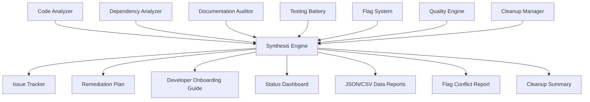
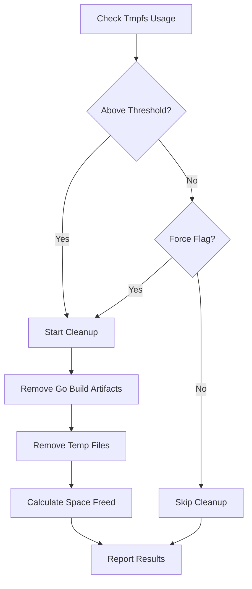

# Design Document

## Overview

The major checkpoint design provides a comprehensive framework for analyzing, documenting, and improving the hashi project's codebase stability and maintainability. The design follows a systematic approach: analyze current state, identify issues, create comprehensive documentation, implement missing tests, and provide a prioritized remediation plan with integrated resource management and cleanup.

## Architecture

The major checkpoint system consists of six main analysis engines working in parallel, followed by a synthesis phase that creates actionable deliverables, with integrated cleanup management:



### Analysis Engines

1. **Code Analyzer**: Static analysis, security scanning, code quality assessment
2. **Dependency Analyzer**: Dependency auditing, vulnerability scanning, update recommendations
3. **Documentation Auditor**: Documentation completeness, accuracy validation, example testing
4. **Testing Battery**: Test coverage analysis, test discovery, selective test execution with resource management
5. **Flag System**: CLI flag cataloging, status classification, conflict detection
6. **Quality Engine**: Code quality metrics, standards compliance checking, performance analysis
7. **Cleanup Manager**: Temporary file management, tmpfs monitoring, resource cleanup

### Synthesis Engine

Aggregates findings from all analysis engines to produce prioritized, actionable outputs.

**Key Functions**:
- `Aggregate()`: Collects all findings and status records from analysis engines
- `GenerateRemediationPlan()`: Creates prioritized markdown remediation plan
- `GenerateStatusDashboard()`: Produces high-level project health overview
- `GenerateOnboardingGuide()`: Creates comprehensive developer onboarding documentation
- `GenerateJSONReport()`: Produces machine-readable JSON data export
- `GenerateCSVReport()`: Produces machine-readable CSV data export
- `SortIssues()`: Prioritizes issues by severity, impact, and effort estimation

**Current State Findings**:
- [FINDINGS POPULATED BY ACTUAL ANALYSIS EXECUTION]

## Components and Interfaces

### Code Analyzer
**Current State Findings**:
- [INSERT FINDINGS FOR PROJECT PACKAGES]
- [INSERT FINDINGS FOR SECURITY/DEBT]
- [INSERT FINDINGS FOR CODE QUALITY]

### Dependency Analyzer
**Current State Findings**:
- [INSERT FINDINGS FOR DEPENDENCIES]
- [INSERT FINDINGS FOR SECURITY VULNERABILITIES]
- [INSERT FINDINGS FOR UPDATE RECOMMENDATIONS]

### Documentation Auditor
**Current State Findings**:
- [INSERT FINDINGS FOR README/GUIDELINES]
- [INSERT FINDINGS FOR ADRS]
- [INSERT FINDINGS FOR USER DOCS]

### Testing Battery
**Current State Findings**:
- [INSERT FINDINGS FOR EXISTING TESTS]
- [INSERT FINDINGS FOR COVERAGE GAPS]
- [INSERT FINDINGS FOR INTEGRATION/PROPERTY TESTS]

### Flag System
**Current State Findings from Code Analysis**:
- [INSERT FINDINGS FOR CORE FLAGS]
- [INSERT FINDINGS FOR OUTPUT/FILTERING FLAGS]
- [INSERT FINDINGS FOR CONFIG/BEHAVIOR FLAGS]

### Quality Engine
**Current State Findings**:
- [INSERT FINDINGS FOR GO STANDARDS]
- [INSERT FINDINGS FOR CLI DESIGN]
- [INSERT FINDINGS FOR ERROR HANDLING/PERFORMANCE]

## Data Models

### Issue Record

```go
type Issue struct {
    Status      IssueStatus
    ID          string
    Category    IssueCategory
    Severity    Severity
    Title       string
    Description string
    Location    string
    Suggestion  string
    Effort      EffortEstimate
    Priority    Priority
    Reviewed    bool          // Indicates if issue was previously reviewed and approved
    ReviewNote  string        // Reason why issue was marked as acceptable
}

type IssueStatus string
const (
    Pending    IssueStatus = "pending"
    InProgress IssueStatus = "in_progress"
    Resolved   IssueStatus = "resolved"
    WontFix    IssueStatus = "wont_fix"
)

type IssueCategory string
const (
    CodeQuality     IssueCategory = "code_quality"
    Documentation   IssueCategory = "documentation"
    Testing         IssueCategory = "testing"
    Security        IssueCategory = "security"
    Performance     IssueCategory = "performance"
    Usability       IssueCategory = "usability"
)
```

### Review Marker Format

Review markers follow a standardized format in code comments:
```go
// Reviewed: [Reason for approval]
// Example: 
// Reviewed: Kept long function because it is a table-driven test with necessary test data.
```

When code with review markers is modified, the analysis system automatically removes the markers to trigger re-evaluation.

### Cleanup Result Record

```go
type CleanupResult struct {
    FilesRemoved     int
    DirsRemoved      int
    SpaceFreed       int64
    Errors           []string
    Duration         time.Duration
    TmpfsUsageBefore float64
    TmpfsUsageAfter  float64
}
```

### Cleanup Manager

```go
type CleanupManager struct {
    verbose bool
}

// Key methods:
// - CleanupTemporaryFiles() removes Go build artifacts and temp files
// - CheckTmpfsUsage(threshold) monitors tmpfs usage
// - CleanupOnExit() performs cleanup with summary reporting
```

### Flag Status Record

```go
type FlagStatus struct {
    Name            string
    ShortForm       string
    LongForm        string
    Status          ImplementationStatus
    Description     string
    ExpectedBehavior string
    ActualBehavior  string
    TestCoverage    bool
    Documentation   bool
    Issues          []string
}

type ImplementationStatus string
const (
    FullyImplemented     ImplementationStatus = "fully_implemented"
    PartiallyImplemented ImplementationStatus = "partially_implemented"
    NeedsRepair          ImplementationStatus = "needs_repair"
    NeedsRefactoring     ImplementationStatus = "needs_refactoring"
    PlannedNotImplemented ImplementationStatus = "planned_not_implemented"
    Deprecated           ImplementationStatus = "deprecated"
)
```

### Test Coverage Report

```go
type CoverageReport struct {
    Package         string
    CurrentCoverage float64
    TargetCoverage  float64
    MissingTests    []string
    ExistingTests   []TestInfo
    Recommendations []string
}

type TestInfo struct {
    Name        string
    Type        TestType
    Coverage    []string
    Quality     TestQuality
}
```

## Correctness Properties

*Properties are characteristics that should hold true across all valid executions—formal statements about what the system should do.*

**Property 1: Comprehensive Code Analysis Coverage**
*For any* Go source file in the project, running code analysis should identify all quality issues, security vulnerabilities, and technical debt present in that file
**Validates: Requirements 1.1, 1.2, 1.5**

**Property 2: Test Coverage Accuracy**
*For any* package in the project, the coverage evaluation should accurately measure and report the actual test coverage percentage
**Validates: Requirements 1.3**

**Property 3: Documentation Completeness Validation**
*For any* public function or type in the codebase, the documentation audit should correctly identify whether proper Go documentation exists
**Validates: Requirements 2.1**

**Property 4: Documentation Example Correctness**
*For any* example in the documentation, validation should correctly determine whether the example executes successfully and produces expected results
**Validates: Requirements 2.2, 2.3**

**Property 5: Comprehensive Test Suite Validation**
*For any* function or workflow in the system, the testing analysis should correctly identify existing tests and coverage gaps
**Validates: Requirements 3.1, 3.2, 3.3, 3.4, 3.5**

**Property 6: Test Suite Reliability**
*For any* test in the testing battery, running the test multiple times should produce consistent results across different environments
**Validates: Requirements 3.6, 3.7, 3.8**

**Property 7: Flag Discovery Completeness**
*For any* CLI flag defined in the codebase, the flag documentation system should discover and catalog that flag
**Validates: Requirements 4.1**

**Property 8: Flag Status Classification Accuracy**
*For any* cataloged flag, the classification system should correctly determine its implementation status based on actual code analysis
**Validates: Requirements 4.2, 4.3**

**Property 9: Flag Documentation Consistency**
*For any* flag, the documented behavior should match the actual implemented behavior when tested
**Validates: Requirements 4.4, 4.5, 4.6, 4.7**

**Property 10: Flag Conflict Detection Completeness**
*For any* conflict between flag sources, the system should detect and categorize the discrepancy
**Validates: Requirements 4.8, 4.9, 4.10, 4.11, 4.12**

**Property 11: Review Marker Recognition and Management**
*For any* code with review markers, the system should skip flagging approved issues and remove markers when code changes
**Validates: Requirements 13.1, 13.2, 13.3**

**Property 12: Resource Management and Cleanup Effectiveness**
*For any* cleanup operation, the system should successfully remove temporary artifacts and reduce tmpfs usage without errors
**Validates: Requirements 14.1, 14.2, 14.3, 14.4, 14.5, 14.6, 14.7**

## Cleanup System Architecture

The cleanup system provides multiple interfaces for managing temporary build artifacts and preventing tmpfs exhaustion:

### Cleanup Interfaces

1. **Core Library** (`internal/checkpoint/cleanup.go`)
   - `CleanupManager` with configurable verbosity
   - Removes Go build artifacts (`/tmp/go-build*`)
   - Removes project temporary files (hashi-*, checkpoint-*, test-*, *.tmp)
   - Tracks cleanup statistics and tmpfs usage

2. **Standalone Command** (`cmd/cleanup/main.go`)
   - Command-line interface with flags: `-verbose`, `-dry-run`, `-force`, `-threshold`
   - Independent execution: `go run cmd/cleanup/main.go`
   - Threshold-based cleanup triggering

3. **Shell Script Wrapper** (`scripts/cleanup.sh`)
   - Colored output for enhanced user experience
   - Same functionality as Go command with shell conveniences
   - Usage: `./scripts/cleanup.sh -v -f`

4. **Integrated Cleanup**
   - Automatic cleanup after checkpoint analysis completion
   - Cleanup on failure to prevent artifact accumulation
   - Pre-analysis tmpfs usage warnings

### Cleanup Workflow



## Error Handling

The major checkpoint system implements comprehensive error handling across all analysis engines:

### Error Categories

1. **Analysis Errors**: Issues during code scanning, dependency checking, or static analysis
2. **Documentation Errors**: Problems accessing or parsing documentation files
3. **Test Execution Errors**: Failures during test discovery or selective execution
4. **Flag Discovery Errors**: Issues identifying or testing CLI flags
5. **System Errors**: File system access, permission, or resource issues (e.g., tmpfs exhaustion during high-intensity build/test operations)
6. **Cleanup Errors**: Issues during temporary file removal or tmpfs management

### Error Recovery Strategies

- **Graceful Degradation**: Continue analysis even if some components fail
- **Partial Results**: Report findings from successful analysis engines
- **Detailed Logging**: Comprehensive error reporting for debugging
- **Retry Logic**: Automatic retry for transient failures
- **User Guidance**: Clear error messages with suggested remediation steps

### Error Reporting

All errors are collected and included in the final remediation plan with:
- Root cause analysis
- Impact assessment
- Recommended resolution steps
- Priority classification

## Testing Strategy

The major checkpoint employs a dual testing approach combining unit tests for specific functionality and property-based tests for universal correctness properties.

### Testing Boundary (Dogfooding Strategy)

To prevent infinite meta-testing recursion ("watching the watchers"), we adhere to the following architectural boundary:

1.  **Layer 0 (Application)**: `cmd/hashi` and core logic. Tested by standard Unit/Integration tests.
2.  **Layer 1 (Tooling)**: `internal/checkpoint`. Tested by standard Unit/Property tests to ensure accuracy.
3.  **Layer 2 (Meta-Tooling)**: **Explicitly Rejected.** We do not build tools to verify the verification tools.

**The Solution: Self-Analysis**
Once the Checkpoint system (Layer 1) passes its own unit tests, it is configured to analyze the entire repository, including itself. This "Dogfooding" approach ensures the tooling remains compliant with project standards without requiring a separate meta-analysis framework.

### Unit Testing Focus

- **Analysis Engine Components**: Test individual analysis functions with known inputs
- **Data Model Validation**: Verify correct parsing and serialization of issue records
- **Error Handling**: Test error conditions and recovery mechanisms
- **Integration Points**: Validate communication between analysis engines
- **Output Generation**: Test report and documentation generation

### Property-Based Testing Configuration

- **Library**: Use Go's testing/quick package or testify/suite for property-based tests
- **Iterations**: Minimum 100 iterations per property test
- **Test Tags**: Each property test tagged with format: **Feature: major-checkpoint, Property {number}: {property_text}**

### Property Test Implementation

Each correctness property is implemented as a property-based test in `internal/checkpoint/property_test.go`:

1. **Property 1 Test**: Generate random Go files with known issues, verify analysis detects them
2. **Property 2 Test**: Generate packages with known coverage, verify accurate measurement
3. **Property 3 Test**: Generate public functions with/without docs, verify detection
4. **Property 4 Test**: Generate documentation examples, verify execution validation
5. **Property 5 Test**: Generate functions/workflows, verify test validation
6. **Property 6 Test**: Run tests multiple times, verify consistency
7. **Property 7 Test**: Generate flag definitions, verify discovery
8. **Property 8 Test**: Generate flags with known status, verify classification
9. **Property 9 Test**: Generate flags with behavior, verify documentation consistency
10. **Property 10 Test**: Generate flag conflicts, verify detection
11. **Property 11 Test**: Generate code with review markers, verify recognition
12. **Property 12 Test**: Generate temporary files, verify cleanup effectiveness

### Unit Testing Focus

- **Analysis Engine Components**: Test individual analysis functions with known inputs (all engines have `*_test.go` files)
- **Data Model Validation**: Verify correct parsing and serialization of issue records
- **Error Handling**: Test error conditions and recovery mechanisms
- **Integration Points**: Validate communication between analysis engines
- **Output Generation**: Test report and documentation generation
- **Cleanup Operations**: Test temporary file removal and tmpfs management

### Integration Testing

- **End-to-End Workflows**: Complete analysis pipeline from start to finish via `cmd/checkpoint/main.go`
- **Cross-Engine Communication**: Verify data flow between analysis engines through `Runner`
- **Output Validation**: Ensure generated reports are complete and accurate
- **Resource Management**: Validate cleanup operations and tmpfs monitoring
- **Performance Testing**: Validate analysis completes within reasonable time limits without resource exhaustion

### Continuous Validation

- **Regression Testing**: Ensure improvements don't break existing functionality
- **Coverage Monitoring**: Track test coverage improvements over time
- **Quality Metrics**: Monitor code quality improvements through iterations
- **Resource Usage**: Monitor tmpfs usage and cleanup effectiveness
- **Performance Testing**: Validate analysis completes within reasonable time limits

### Continuous Validation

- **Regression Testing**: Ensure improvements don't break existing functionality
- **Coverage Monitoring**: Track test coverage improvements over time
- **Quality Metrics**: Monitor code quality improvements through iterations